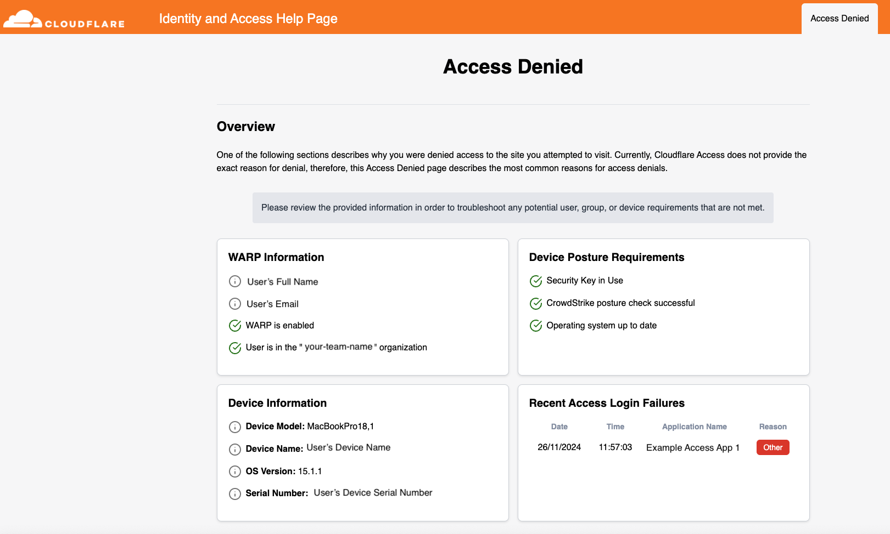
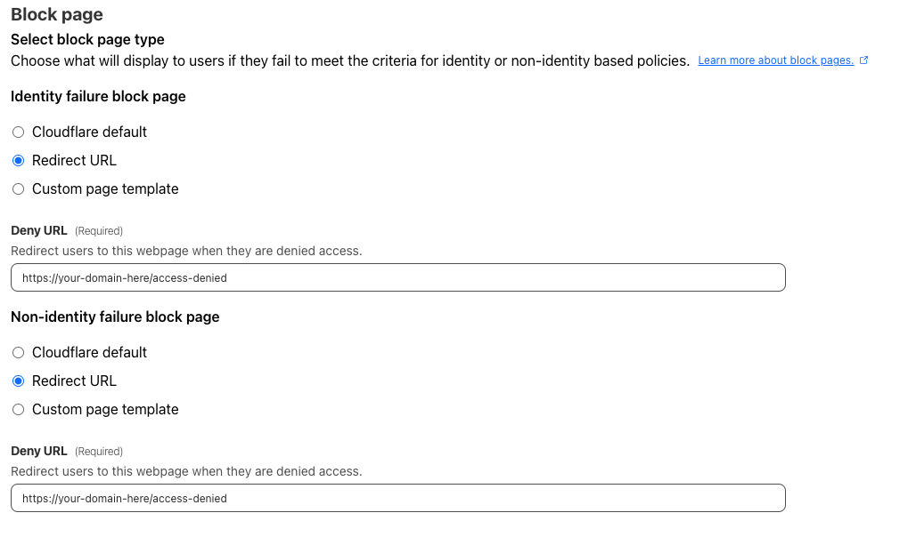
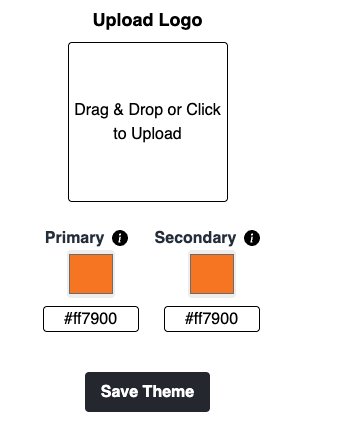

# Cloudflare Identity and Access Help Page

A highly customizable block page built in Cloudflare Workers that provides enriched Access Deny reasoning to end users. The page dynamically fetches user information from `/cdn-cgi/access/get-identity` and presents it in a user friendly format.

  

Features of this page include:

1. Verifying and displaying if user has WARP enabled
2. Displaying device posture rule status for Crowdstrike
3. Dispalying device Operating System posture rules
4. Security Key usage
5. Correct Access team assignment
6. Displaying users device information
7. IDP group information and special IdP group identification
8. Recent Access login failures (last 3 in 30 minutes)

## Getting Started

**Pre-Deployment Requirements**

1. Create an api token that has the following [permissions](https://developers.cloudflare.com/fundamentals/api/reference/permissions/), this will be used by the worker for data enrichment (apiv4 and graphQL requests).

   * Access: Audit Logs Read
   * Access: Device Posture Read
2. Create a new Cloudflare Access application (Self Hosted) https://developers.cloudflare.com/cloudflare-one/applications/configure-apps/

   * Apply the restrictions to this new application that would typically apply to your organization (ie. Allow only specific email domains/authorized users) - This will restrict external, potentially unauthorized requests to the worker.
   * Set the Application session duration to the lowest available option.
3. Update Access applications block page to point to the deny worker's domain.

   * 

**Deploying Worker:**

1. Update the wrangler.toml;

   * Name: your worker name
   * workers_dev: Ideally keep this false as it will be using a custom domain, protected by Cloudflare Access.
   * Routes, Pattern: Set this to your previously created Access Application domain.
   * BEARER_TOKEN: This is the previously generated API token. Ideally this token should not exist in plain text in the codebase. This is commented out in the toml and instead is added as a workers [secret](https://developers.cloudflare.com/workers/configuration/secrets/)
   * CORS_ORIGIN: This set this to your domain, appended with `/debug`
   * ACCOUNT_ID: Your target account ID, used in constructing api requests.
   * ORGANIZATION_ID: Your target account ID, used in verifying if users are indeed registed to the correct Cloudflare ZT organization.
   * TARGET_GROUP: If you have a specific group identity that could be considered restricted, or flagged, then set this to the group name. If a user has the target group assigned to their identity, a notification will appear.
2. Create KV, this will be used for setting theme elements, as well as the uploaded logo. `wrangler kv:namespace create IDENTITY_DYNAMIC_THEME_STORE`
3. Update the kv_namespaces id in the wrangler.toml to match the newly created `IDENTITY_DYNAMIC_THEME_STORE`ID.

**Customizing Theme elements:**

1. Set DEBUG = "true" in the wrangler.toml and if needed, redeploy the worker - this will allow enable the debug page.
2. Visit your-domain/debug
3. Upload logo and select color primary and secondary colors

   * 

## Additional details

The worker exposes 3 endpoints and makes seperate 2 API calls for device and posture information. These are endpoints used by the worker internally using subrquests.

* `api/userdetails`: combined json output from get-identity, and device + posture information
* `api/history`: [GraphQL](https://developers.cloudflare.com/analytics/graphql-api/tutorials/querying-access-login-events/) output for Access logs
* `api/env`: Exposed worker environment variables for component interaction

**DEPENDANCES**:

* react-loader-spinner
* react-router-dom
* react-dom
* tailwindcss

**Page Summary:**

* AccessDenied.js
  * Displays the main content of the worker at /access-denied.
* Debug.js
  * Is used for intial setup and theme configuration, as well as debugging data from get-identity
* Information.js
  * Can be configured to display any additional information or FAQs for end users

**Component Summary:**

* Overview.js
  * Contains warp information + Device information
* Posture.js
  * Contains posture information, does the correlation checks for overal status
* History.js
  * Interacts with the /api/history endpoint, displays Access login responses from graphql
* Setup.js
  * Theme management and logo uploads
* OriginalUrl
  * Shows the "redirected from" message when blocked.
* Specialgroup.js
  * Used for risk-reduction group notification, this is defined in the wrangler.toml as "TARGET_GROUP"
